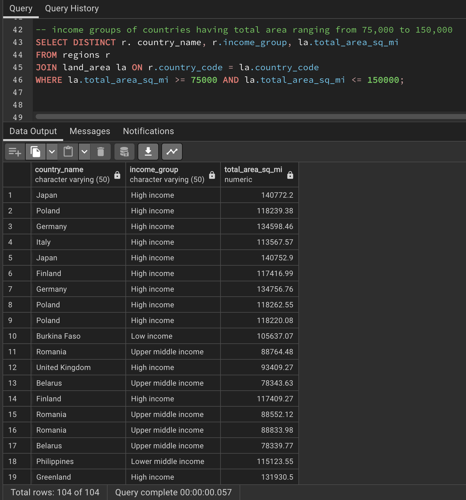
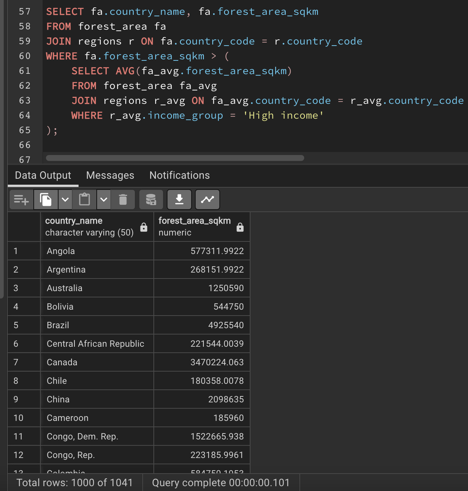
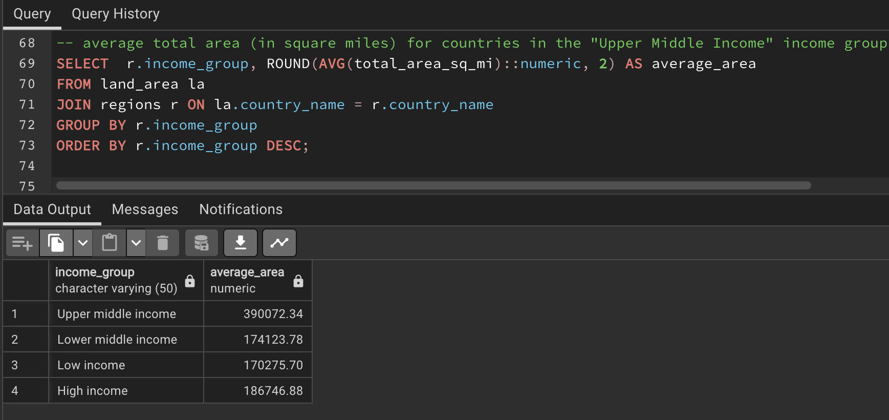

# Global-Greenery-Metrics-Analyzing-Environmental-Data-for-Countries-and-Regions
Analyzing environmental data related to land area and forest area across different countries and regions

## Introduction
The greenery dataset was provided with three(3) files which represented our tables. We have Regions, land area, and forest area which can be seen under the names **forest area.csv**, **land area.csv** and **regions.csv** in the file section and I performed data analysis using SQL. The dataset contains information about various countries, country codes, regions, forest square kilometres, total area square miles, year and income group details.

## Problem Statement
I wanted to find a way to understand the environment and things that affect it like deforestation, countries with large forests and the total area of countries. 
The following questions were asked and the answers were provided to questions and problems below.

1. Find the total number of countries involved in deforestation.
2. Show the income groups of countries having total area ranging from 75,000 to 150,000?
3. Retrieve the names of countries that have a forest area (in square kilometres) greater than the average forest area of all countries in the "High Income" income group.
4. Calculate the average total area (in square miles) for countries in the "Upper Middle Income" income group? Compare the result with the rest of the income categories.
Hint: calculate the average total areas for the 3 other categories.
5. Determine the total forest area (in square kilometres) for countries in the "High Income" income group? Also, compare with the other income categories.
6. What are the countries from each region or continent having the highest total forest area?

## Data Analysis
The analysis was done using three(3).csv files that were provided. The 3 tables provided were the Forest area table, the Land area table and the Regions table.  
The Forest area table had 4 columns; country code, country name, year and forest area per square kilometre.  
The Land area table had 4 columns; country code, country name, year and total area per square mile.  
The Regions table also had 4 columns; country name, country code, region and income group.  

The first step I took was to create a database called Greenery. After creating the Greenery Database, the next step was creating 3 tables named forest_area, land_area and regions.  
The Forest area table had 4 columns; country code, country name, year and forest area per square kilometre.  

Then, you check to see if the table has been created.

The Land area table had 4 columns; country code, country name, year and total area per square mile.  

Then, you check to see if the table has been created.

The Regions table also had 4 columns; country name, country code, region and income group.  

Then, you check to see if the table has been created.

The next step was to import the .csv files into the table to put rows and values into our table created. There are two ways to import files into the table in PostgreSQL.

Import the files by right-clicking on the table name on the right-hand side and then selecting Import/Export data and then selecting the location/folder where your .csv file is located and then importing.  

OR  

Writing up a code or query in the query tool. The code to write is

COPY table_name

FROM 'file-path/location of file'

DELIMITER ','

CSV HEADER;

the file is now uploaded into the tables in PostgreSQL.

After the uploading was done, the next step was to check if your tables had values by running the query SELECT * FROM  table_name which they did.  

For forest area table

For land area table

For the regions table, I cleaned the regions table by removing a region called World as it was not a region and It was included my mistake.

Now, we had our full tables to work with, we decided to answer and solve the business problems.

1. The total number of countries involved in deforestation.  
It only includes countries that fall within the forest area range and have recorded deforestation (forest area is either negative or NULL). The DISTINCT keyword ensures that each country appears only once in the result. The result will be ordered by country name. We have 14 countries. 

2. The names of countries that have a forest area (in square kilometres) greater than the average forest area of all countries in the "High Income" income group.  
This query provides insights into the income groups of countries that have a total area within the specified range, helping to categorize and understand the distribution of income groups within that particular land area range.

3. The names of countries that have a forest area (in square kilometres) greater than the average forest area of all countries in the "High Income" income group.  
Retrieves the country names of countries with a forest area greater than the calculated average, along with the average itself. First of all, I had to find out the average itself so that I have an idea of what it was. The average forest area was 391,051.84

Then now I could not find countries that have forest area greater than the average forest area.

4. The average total area (in square miles) for countries in the "Upper Middle Income" income group.  
The output sheds light on the average land area of countries falling within the "Upper Middle Income" income group. It helps in understanding the distribution of land sizes for countries with this particular income status.

                                  

 5. The total forest area (in square kilometres) for countries in the "High Income" income group.  
This provides insights into the cumulative forested area in square kilometres for countries within the "High Income" income group. It helps in understanding the collective impact of forested areas for countries with this particular income status.

                                  
 
 6. Countries from each region or continent having the highest total forest area
Rank countries within each region based on the forest area. Selects the top country with the highest forest area for each region.

              

                                      

## Conclusion
In delving into the depths of our greenery dataset, I have found invaluable insights that explain Through meticulous data manipulation and analysis related to forest and land areas, income groups, and regional classifications.  
I sought to Explore the impact of deforestation by identifying countries involved in deforestation activities. Discover the nations that have experienced forest area reduction and deforestation, shedding light on critical environmental challenges  
Gained a great perspective on income groups and their distribution within specified total area ranges.  
Discovered countries with forest areas exceeding the average within the 'High Income' income group.  Uncover the total forest area for these nations and compare it to other income categories. These insights offer a clear picture of how wealth correlates with forest preservation efforts.  
Delved into regional insights by identifying countries with the highest forest areas within each region.

